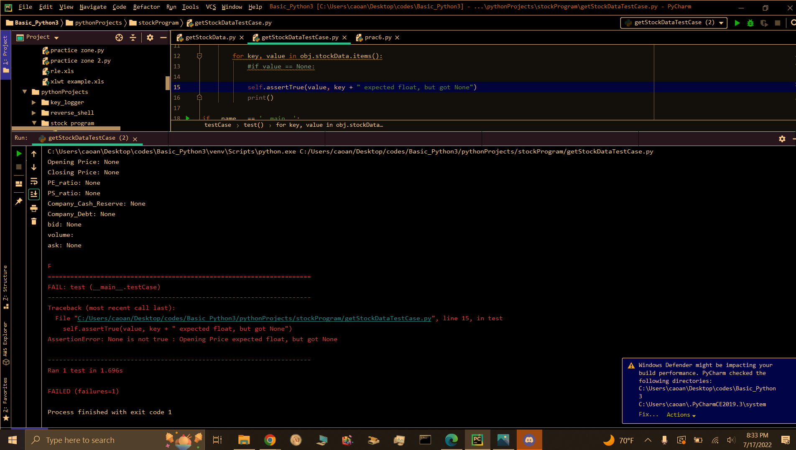

# Assignment 2 
Total score: 70 
Due date: 7/17 

## TEAM:
```
Olvin Bolanos
Anthony Cao
Thomas Tran
Jacob Ursenbach
Greg Zhang
```

## Goals 
• Analysis of customer requirements, writing user requirements, CRC modeling, and class 
or module design, beginning development 

## Requirements for this assignment 

### 1. Analyze all the features of the system specified in the project description document and 
identify all the requirements to implement the features. 
```

```
### 2. Write all the necessary use cases or user stories to implement the feature (a) of the system. 
See assignment #1 for feature (a).  
```
# Use Cases

## ID: DC-1

### name: 
Return Stock Data

### description: 
The user supplies the system a valid stock symbol, upon which the system returns data for the given stock

### Primary Actor: 
User

### preconditions: 
1. User has a stock symbol to supply to the system
2. User has access to the system
3. yfinance module is imported on the system

### postconditions: 
stock data is retrieved and displayed for the user

### main success scenario:
1. User inputs a valid stock symbol
2. The system uses the stock symbol to retrieve stock data from yahoo finance
3. the system will display the stock data for the user


## ID: DC-2

### name: 
Get back testing results

### Description: 
After the user selects a stock for analysis. The system will provide a list of buy and sell strategies for the user to choose. Afterwards, the system will conduct back testing based on the stock and strategy the user chose and display the results to the user.


### Primary actor: 
user

### Pre-conditions: 
user has selected a stock for analysis

### Post conditions: 
User chooses buy and sell strategies provided by the system.

### Main success scenario: 
1. The system allows the user to select a stock.
2. The system will then display the buy and sell strategies to the user to select.
3. User will click the button to start back testing.
4. system will conduct back testing
5. System will display backtesting results to the user


## ID: DC-3

### name: 
create tentative portfolio

### description: 
The user creates a tentative portfolio containing stocks they have selected along with their corresponding buy and sell strategies.
#
## Primary actor: 
user

### pre-conditions: 
User has selected a stock for analysis, as well as choosing a buy and sell strategy for that stock that was provided by the system.

### post conditions: 
The user is able to store the selected stock and strategy inside a portfolio.

### Main success scenario:
1. User selects an option to create a tentative portfolio
2. The system will create an empty portfolio
3. User chooses stocks, backtesting results, and strategy name to store inside the portfolio
4. The system will store the selected stocks and corresponding data inside the portfolio
5. system will save the portfolio that can be retrieved by both system and user.


# user stories

### ID: BC-1

### name: 
Return Stock Data

### Actor:
user

### description: 
User inputs valid stock symbol, the system will then gather data from yahoo finance corresponding to the given stock and display the data for the user.


## ID: BC-2

### name: 
Get Back Testing Results

### actor: 
user

### description: 
The system will conduct backtesting on the given stock and strategy that the user chose. The results will be displayed for the user.


## ID: BC-3

### name: 
create tentative portfolio

### actor: 
user

### description: 
The user creates a tentative portfolio containing stocks they have selected along with their corresponding buy and sell strategies.

```
### 3. Create all the necessary CRC cards.  
```
## Class: GetStockData

### Description: 
This class takes a stock symbol as a parameter. It will then retrieve detailed information about the stock from yahoo finance and display it to the user. 

### Responsibilities:
1. Get stock data from yahoo finance
2. store data in JSON
3. display data to user??

### Collaborators:
1. BackTesting
2. CreateTentativePortfolio


## Class: BackTesting

### Description: 
This class will conduct backtesting based on the given stock and strategy the user chooses. Afterwards, it will display the results to the user.


### Responsibilities:
1. Allows the user to select a stock.
2. Display buy and sell strategies for the use to choose
3. Allows the user to click a button to start backtesting
4. conducts backtesting on the selected stock
5. Display backtesting result to the user

### Collaborators:
1. GetStockData
2. CreateTentativePortfolio


## Class CreateTentativePortfolio

### Description: 
This class will allow the user to create a tentative portfolio where the user can store their selected stocks along with their corresponding buy and sell strategies.

### Responsibilities:
1. Take user input to create a portfolio
2. Define an empty data structure that will serve as the portfolio
3. Store user-selected stock, and corresponding data inside portfolio
4. save portfolio so that it can be read and retrieved

### Collaborators:
1. BackTesting
2. GetStockData
```
### 4. Create a class or module diagram. You can use actual paper or a whiteboard to draw the 
diagram. You don’t need to use any UML tool to draw a diagram, although you are welcome 
to do it. 


### 5. Implement the feature (a) with at least one test case. ** No visual user interface is necessary. ** 
To get the data, use a free package, e.g., “yfinance” in Python, “yahoo-finance” in 
JavaScript, etc., or implement one yourself.  
stockData.py
```
#!/usr/bin/env python3
# --------------------------------------------------------------------
# CPSC 362-01
# Coding Team:   Group 1
__authors__ = ["Olvin Bolanos", "Anthony Cao", "Thomas Tran", "Jacob Ursenbach", "Greg Zhang"]
__copyright__ = "Open Source"
__credits__ = ["Olvin Bolanos", "Anthony Cao", "Thomas Tran", "Jacob Ursenbach", "Greg Zhang"]
__license__ = None
__version__ = "0.0.5"
__maintainer__ = "Jacob Ursenbach"
__email__ = "jacob.ursenbach@gmail.com"
__status__ = "Production"
__last_update__ = 20220716
# --------------------------------------------------------------------
#
# getStockData class Returns predefined set of stock data for a stock symbol given by user 
#

import yfinance
import yahoo_fin.stock_info as stockInfo


class getStockData:
    def __init__(self, symbol: str = None):
        """
        :param symbol:
        """
        self.stock_symbol = None
        self.stock_data = {"Opening Price": None, "Closing Price": None, "PE_ratio": None,
                          "PS_ratio": None, "Company_Cash_Reserve": None, "Company_Debt": None,
                          "bid": None, "volume": "", "ask": None}

        if symbol:
            self.set_symbol(symbol)
            self.retrieveData()

    def retrieveData(self):
        """
        :return:
        """
        getInfo = yfinance.Ticker(self.stockSymbol)
        getInfo2 = stockInfo.get_quote_table(self.stockSymbol)

        self.stockData["Company_Cash_Reserve"] = getInfo.info["totalCash"]
        self.stockData["Company_Debt"] = getInfo.info["totalDebt"]

        self.stockData["Opening Price"] = getInfo2["Open"]
        self.stockData["bid"] = getInfo2["Bid"]
        self.stockData["volume"] = getInfo2["Volume"]
        self.stockData["ask"] = getInfo2["Ask"]
        self.stockData["Closing Price"] = getInfo2["Previous Close"]
        self.stockData["PE_ratio"] = getInfo2["PE Ratio (TTM)"]

        val = stockInfo.get_stats_valuation(self.stockSymbol)
        val = val.iloc[:, : 2]
        val.columns = ["Attribute", "Recent"]

        PS = float(val[val.Attribute.str.contains("Price/Sales")].iloc[0,1])

        self.stockData["PS_ratio"] = PS

    def set_symbol(self, symbol: str):
        """
        :param symbol:
        :return:
        """
        self.stockSymbol = symbol

    def return_data(self):
        """
        :return:
        """
        return {self.stockSymbol: self.stockData}

    def scrape_stock(self, symbol: str) -> str:
        """
        :param symbol:
        :return:
        """


def main():
    scraper = getStockData("FB")
    scraper.retrieveData()
    print(scraper.return_data())


if __name__ == "__main__":
    main()

"""self.stockData["open"] = getInfo.info["open"]
        self.stockData["bid"] = getInfo.info["bid"]
        self.stockData["volume"] = getInfo.info["volume"]
        self.stockData["ask"] = getInfo.info["ask"]
        self.stockData["close"] = getInfo.info["regularMarketPreviousClose"]"""
```

stockDataTest.py
```
lines (14 sloc)  505 Bytes

import unittest
#reset the path for this if not using on my laptop
from pythonProjects.stockProgram.getStockData import StockData

class testCase(unittest.TestCase):
    def test(self):
        obj = StockData("8")
        obj.retrieveData()
        print(obj)


        for key, value in obj.stockData.items():
            #if value == None:

            self.assertTrue(value, key + " expected float, but got None")
            print()

if __name__ == '__main__':
    unittest.main()
```




# Acceptance criteria 
A list of all the necessary use cases or user stories and CRC cards in the format discussed in class 
that meet the requirements of all the features for both the user and developers to implement. 
Correct class diagram 
Functional feature (a) 
 
